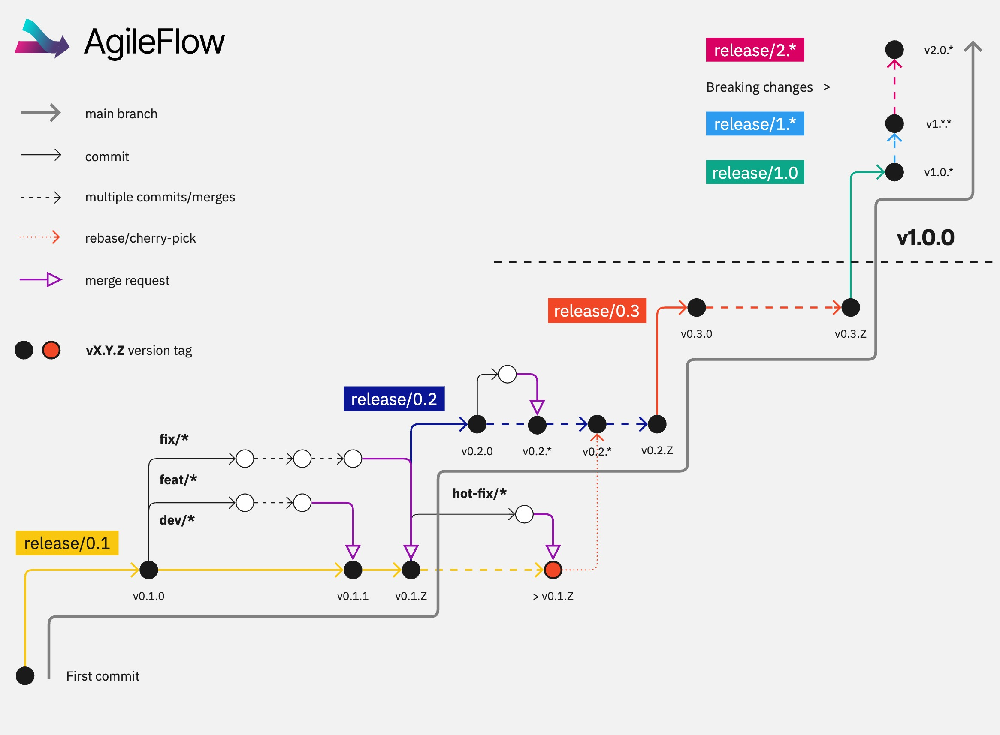

# AgileFlow

In today’s fast-paced software development landscape, maintaining clarity, consistency, and efficiency in the release process is essential. AgileFlow is a streamlined yet powerful versioning system, branching strategy, and CI/CD tool designed for software teams of all sizes and projects of any scale.

AgileFlow enforces Semantic Versioning and integrates a robust branching strategy for development and deployment. It seamlessly works with GitLab CI and GitHub Actions CI/CD pipelines to ensure a structured, efficient, and predictable development lifecycle. Whether for small projects or large-scale deployments, AgileFlow is an indispensable tool that simplifies versioning and release management.


## Quick Start

[Install AgileFlow](#install) in your repo with the following command. It requires repository maintainer or owner equivalent permissions in your origin remote.

  ```bash
  /bin/bash -c "$(curl -fsSL https://code.logickernel.com/kernel/agileflow/-/raw/release/0.2/install.sh)"
  ```

After completing the command and instructions successfully, AgileFlow will be integrated with the CI/CD engine to [create automatically a new version](#versioning) every time there’s a merge into a release branch, incrementing the patch number based on the latest identifiable version in the branch.

1. [Create a release branch](#release-branches) using the product's current **MAJOR** and **MINOR** version numbers, e.g. `release/0.1`, `release/1.0`, `release/1.1`, etc.
2. [Create development branches](#development-branches) for contributors, following the naming conventions `dev/*`, `feat/*`, `fix/*`, or `hotfix/*` to keep the code organized and ensure smooth merging.
3. [Create new release branches](#create-new-release-branches) for every **MAJOR** or **MINOR** version increment. After `v1.0.0`, ensure that any breaking change increments the **MAJOR** version.




## Contents

- [AgileFlow](#agileflow)
  - [Quick Start](#quick-start)
  - [Contents](#contents)
  - [Install](#install)
    - [Auto Install](#auto-install)
    - [Manual Install](#manual-install)
      - [CI/CD Set Up](#cicd-set-up)
        - [GitLab](#gitlab)
        - [GitHub](#github)
  - [Release Branches](#release-branches)
  - [Development Branches](#development-branches)
  - [Versioning](#versioning)
    - [Tagging](#tagging)
      - [Auto Tagging](#auto-tagging)
      - [Manual Tagging](#manual-tagging)
  - [Main Branch](#main-branch)
  - [Create New Release Branches](#create-new-release-branches)

## Install

AgileFlow can be installed automatically in any software project using a utility script or manually copying the necessary files in the project's directory.

### Auto Install

```bash
/bin/bash -c "$(curl -fsSL https://code.logickernel.com/kernel/agileflow/-/raw/main/install.sh)"
```

Select the CI/CD engine to view the keys and instructions to set them up. If completed successfully, AgileFlow’s CI/CD scripts will automatically version the product.

### Manual Install

Download and place the AgileFlow tool script in your project's root directory. Give it execution permissions.

```bash
curl https://code.logickernel.com/kernel/agileflow/-/raw/main/agileflow
chmod +x agileflow
```

#### CI/CD Set Up

The following instructions will allow your CI/CD engine to automatically version and push the corresponding tag to the repository.

<details>
<summary>

##### GitLab

</summary>

Run the following command to generate a new pair of keys, see setup instructions and to create or update the `.gitlab-ci.yml` file:

```bash
./agileflow install --gitlab
```

Alternatively, you can create a pair of keys and configure GitLab manually:

```bash
./agileflow install --generate
```

**GitLab Keys Setup**

1. Go to your project's **Settings > Repository > Deploy keys**
2. Add the generated public key as a deploy key making sure to grant it write permissions
3. Go to your project's **Settings > CI/CD > Variables**
4. Add a new variable of type **File**, key `AGILEFLOW_KEY` and as value the generated private key. 
   It is recommended to protect the variable so that it's only available in pipelines controlled by an authorized user.

**GitLab CI Setup**

Add the following job to the `.gitlab-ci.yml` file to automatically tag a new version every time there's a push to a release branch: 

```yml
agileflow:
  stage: deploy
  script:
    - ./agileflow tag --key ${AGILEFLOW_KEY}
  only:
    - /^release\/[0-9]+\.[0-9]+$/
```
</details>
<details>
<summary>

##### GitHub

</summary>

Run the following command to generate a new pair of keys, see setup instructions and to create or update the `.github/workflows/agileflow.yml` file:

```bash
./agileflow install --github
```

Alternatively, you can create a pair of keys and configure GitLab manually:

```bash
./agileflow install --generate
```

**GitHub Keys Setup**

1. Go to your repository's settings
2. Add the public key as a deploy key
3. Go to your repository's settings > Secrets
4. Add a new secret called AGILEFLOW_KEY and paste the private key


**GitHub Actions Setup**

```yaml
name: AgileFlow Tag Version

on:
  push:
    branches:
      - 'release/*'

jobs:
  tag_version:
    runs-on: ubuntu-latest
    steps:
      - uses: actions/checkout@v2
      - name: Run AgileFlow
        run: ./agileflow tag --key ${{ secrets.AGILEFLOW_KEY }}
```

</details>

## Release Branches

Release Branches are a main concept in the AgileFlow framework. They are meant to group the product versions. Their name is composed by `release/` followed by the **MAJOR** and **MINOR** numbers of the versions they contain. Use the current product version number in the form `release/<MAJOR>.<MINOR>`, or for still unversioned projects:

- Use `release/0.1` for new projects.
- Use `release/1.0` or a greater **MAJOR** number if the project is already being used in production.

Once the tool is [installed](#install), you can use the following command to create the first release branch or to increase the **MAJOR** or **MINOR** numbers.

```bash
# Use the --dry-run flag to see the new release branch name before altering the remote origin
./agileflow release --dry-run

# Create the first release for your project or perform a MINOR release, create a branch and push it to the origin
./agileflow release
```

## Development Branches

Development branches are used for feature additions and bug fixes. They branch off the release branch they intend to merge into and follow these naming conventions:
  
1. **Generic Development Branches (dev/*)**: Generic development branches for large changes. Specially useful before `1.0.0`.

```bash
# Create a Generic Development Branch
git switch -c dev/generic-development-branch-name
```

2. **Feature Branches (feat/*)**: For developing new features. Merges back into the corresponding release branch when features are ready. Example: `feat/new-login`.

```bash
# Create a Feature Branch
git switch -c feat/feature-branch-name
```

3. **Bug Fix Branches (fix/*)**: For fixing bugs. These are also merged into the relevant release branch. Example: `fix/login-error`.

```bash
# Create a Bug Fix Branch
git switch -c fix/bug-fix-branch-name
```

4. **Hotfix Branches (hotfix/*)**: For urgent fixes in production. They allow applying critical patches without interfering with other in-progress development. Once resolved, these branches are merged back into their release branch, typically after the release has already been finalized.

   Merging strategies like **cherry-picking** or **rebasing** must be used to apply these fixes cleanly into active release branches.

```bash
# Create a Hotfix Branch
git switch -c hotfix/hotfix-branch-name
```


After the contribution is ready, the development branch is merged into its origin Release Branch, preferrably using a [Merge Request](https://docs.gitlab.com/ee/user/project/merge_requests/), a [Pull Request](https://docs.github.com/en/pull-requests/collaborating-with-pull-requests/proposing-changes-to-your-work-with-pull-requests/about-pull-requests), or similar.

## Versioning

Create a new version every time there's a merge into a release branch. AgileFlow enforces strict [Semantic Versioning](https://semver.org), which breaks down version numbers as follows:

- **Major Versions (X.0.0)**: Introduces breaking changes or significant shifts in functionality.
- **Minor Versions (0.Y.0)**: Represents new features, improvements, or non-breaking changes.
- **Patch Versions (0.0.Z)**: Denotes bug fixes or minor tweaks.

### Tagging

#### Auto Tagging

The installed CI/CD script calculates the next version number by increasing the patch number from the previous tag in the branch upon validated merges to the release branches. This keeps versioning consistent and transparent, making it easier to track small changes or bug fixes.

#### Manual Tagging

Use the following command in case no CI/CD is configured or a version tag needs to be created manually:

```bash
# Use the --dry-run flag to see the next version/tag name before altering the remote origin
./agileflow tag --dry-run

# Calculate the next version name, create a tag and push it to the remote origin
./agileflow tag
```


## Main Branch

The main branch represents the latest build of the software. The release branch containing the latest available release is merged into the main branch.

The AgileFlow tool's tag command detects automatically if the current release branch is the latest release branch available in the repo and if so it merges it with the main branch after creating a tag.

If for some reason this behavior needs to be skipped use the flag `--skip-main`.

```bash
# Perform the version tag operations without merging the release branch with the main branch
./agileflow tag --skip-main
```


## Create New Release Branches

Per [Semantic Versioning](https://semver.org), before the product is deployed and used the **MAJOR** version is kept as `0`. 


After the product is used by real users for the first time, it increases the **MAJOR** version to `1` resetting the **MINOR** and **PATCH** value to `0`. Then, when significant, backward-incompatible changes are introduced:

- A new major release branch (e.g. `release/2.0`) is created.
- Older release branches continue to be maintained for minor updates or patches, ensuring stability until the deprecation of older versions is necessary.

Use the Agileflow tool to easily release a major version:

```bash
# Use the --dry-run flag to see the new release branch name before altering the remote origin
./agileflow release --major --dry-run

# Create the next major version, create a branch and push it to the origin
./agileflow release --major
```
