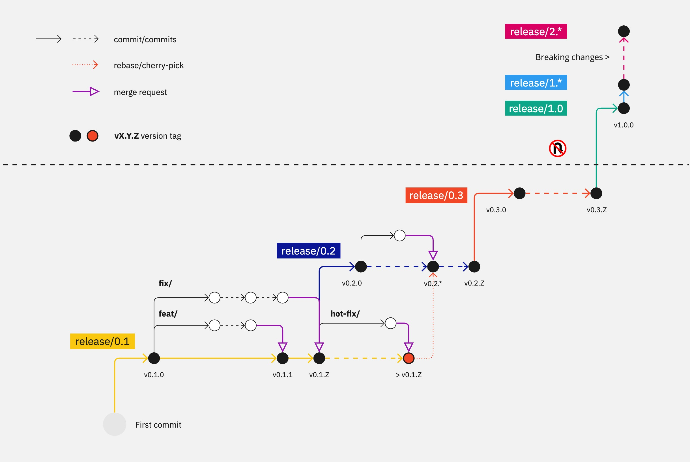

# Agileflow



## Introduction

In the fast-paced world of software development, maintaining clarity, consistency, and efficiency in the release process is crucial. Agileflow is a robust versioning and branching strategy that enforces **Semantic Versioning** while streamlining development workflows. It integrates seamlessly with CI/CD pipelines and source control systems, ensuring a structured and efficient development lifecycle.

## Installing Agileflow

To implement Agileflow in your project, you need to set up the necessary script to manage versioning and branching automatically. We provide a simple installation script that you can use to get started:

### Quick Installation

Run the following command to install Agileflow in your project directory:

```bash
curl -s https://URL/install.sh | bash -s /path/to/your/project --init
```

- Replace `/path/to/your/project` with the actual path where you want to install Agileflow.
- The `--init` flag will initialize the deployment keys and set up the versioning automation for your project.

Once installed, the `Agileflow` script will be placed in the specified directory and can be used to manage your branching and versioning strategy automatically.

### Usage

The Agileflow script can be executed manually or integrated with your CI/CD pipelines. Common usage includes:

- Initializing the deployment key: 
  ```bash
  ./Agileflow --init
  ```
- Managing versioning automatically based on the branch and changes:
  ```bash
  ./Agileflow --key <path_to_private_key>
  ```

For detailed usage, refer to the "Version Tagging and Automation" section below.

## The Agileflow Strategy

### Core Principles

- **Semantic Versioning (vX.Y.Z)**: Agileflow adheres strictly to semantic versioning, with `X` representing major versions, `Y` for minor versions, and `Z` for patches.
- **Automated Patch Management**: Patches are automatically incremented, ensuring consistent and accurate versioning without manual intervention.
- **Structured Branching Model**: Clear branch naming conventions guide the development process, making it easy to identify the purpose of each branch.

### Branching Strategy

Agileflow's branching model ensures clear separation between feature development, bug fixing, and release management:

1. **Release Branches (`release/X.Y`)**: Represents the major and minor versions. Protected and used for stabilizing features before release.
2. **Feature Branches (`feat/*`)**: For developing new functionality. Merge back into the appropriate `release/X.Y`.
3. **Bug Fix Branches (`fix/*`)**: Created for resolving bugs, merged back into the respective `release/X.Y`.
4. **Hotfix Branches (`hotfix/*`)**: For urgent production fixes, providing a mechanism to apply critical patches without risking additional contributions.
5. **Main Branch**: Represents the latest, stable version, integrating validated changes from release branches.

### Workflow

1. **Starting a New Release**: 
   - Create a release branch: `release/0.1`.
   - Develop features (`feat/*`) and fixes (`fix/*`) in separate branches.
2. **Developing & Testing**: 
   - Use CI pipelines to validate merges into `release/X.Y`.
3. **Validating & Tagging**: 
   - Once all changes are stable, the `main` branch is updated, and the version tag (`vX.Y.0`) is created.
4. **Handling Hotfixes**: 
   - Use `hotfix/*` branches for urgent issues, merged back using **cherry-picking** or **rebasing**.

### Version Tagging and Automation

The `Agileflow` script automates version tagging:
- It increments patch versions automatically with each validated change.
- Ensures the release branch is always tagged with the latest version.

### Managing Breaking Changes

For backward-incompatible changes, a new major branch (`release/2.0`) is created. Older branches are maintained for minor updates or patches until deprecation.

## Conclusion

Agileflow provides a disciplined and efficient approach to versioning and release management, ensuring projects stay organized, consistent, and ready for deployment. By installing and integrating the Agileflow script, you ensure your software development process aligns with best practices and remains scalable as your project evolves.