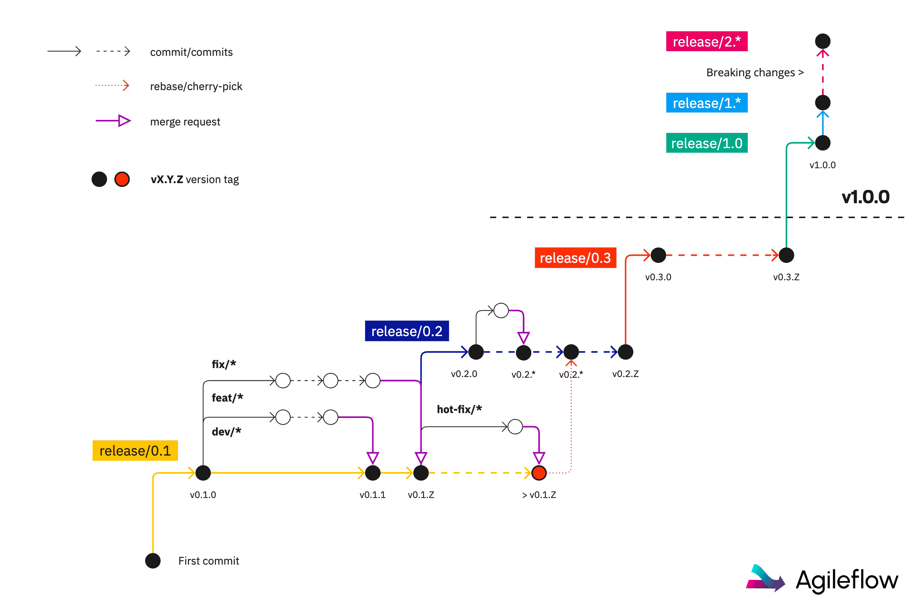

# Agileflow

In today’s fast-paced software development landscape, maintaining clarity, consistency, and efficiency in the release process is essential. Agileflow is a streamlined yet powerful versioning system, branching strategy, and CI/CD tool designed for software teams of all sizes and projects of any scale.

Agileflow enforces **Semantic Versioning** and integrates a robust branching strategy for development and deployment. It seamlessly works with **GitLab CI** and **GitHub Actions** CI/CD pipelines to ensure a structured, efficient, and predictable development lifecycle. Whether for small projects or large-scale deployments, Agileflow is an indispensable tool that simplifies versioning and release management.


## How to Use It

- [Install the Agileflow tool](#install) in your project and configure the necessary Deploy Keys in the CD/CI engine. This enables the tool to automate the tagging and release processes.
- Create a Release Branch using the product's current **MAJOR** and **MINOR** version numbers. Use `release/0.1` for new projects or `release/1.0` or upper if the project is already serving users in production.
- **Create Development Branches** for contributors, following the naming conventions like `feat/*`, `fix/*`, `dev/*`, or `hotfix/*` to keep the code organized and ensure smooth merging.
- **Automatically Tag** each product version when there’s a merge into a release branch, with the patch number incremented based on the latest identifiable version in the branch.
- **Create New Release Branches** for every **MAJOR** or **MINOR** version increment. After `v1.0.0`, ensure that any breaking change increments the **MAJOR** version.



## Install

Agileflow can be installed automatically in any software project using a utility script or manually copying the necessary files in the project's directory.

### Auto Install

```bash
/bin/bash -c "$(curl -fsSL https://code.logickernel.com/kernel/agileflow/-/raw/HEAD/install.sh)"
```

Select the CD/CI engine to view instructions to configure the automatic tagging and release options.

## Versioning

Agileflow enforces strict [Semantic Versioning](https://semver.org), which breaks down version numbers as follows:
- **Major Versions (X.0.0)**: Introduces breaking changes or significant shifts in functionality.
- **Minor Versions (0.Y.0)**: Represents new features, improvements, or non-breaking changes.
- **Patch Versions (0.0.Z)**: Denotes bug fixes or minor tweaks. Patch versions are automatically incremented within the release branches to reduce manual intervention.

### Automated Patch Management

Patches are incremented automatically upon validated merges to the release branches. This keeps versioning consistent and transparent, making it easier to track small changes or bug fixes.


## Branching Strategy

Agileflow's branching model ensures that development and bug fixes are handled in a structured, scalable way.

### Release Branches

- **`release/X.Y`** branches represent each major and minor version.
- These branches are created by maintainers and are **protected** to ensure stability.
- Code is merged into these branches via merge requests or pull requests to prevent accidental or unvalidated changes.
  
Examples:
- `release/0.1` for the first release iteration.
- `release/1.0` for the first stable feature release.
- `release/1.20` for a significant feature set under the same major version.

### Development Branches

Development branches are used for feature additions and bug fixes. They branch off the release branch they intend to merge into and follow these naming conventions:
  
1. **Feature Branches (`feat/*`)**: For developing new features. Merges back into the corresponding release branch when features are ready. Example: `feat/new-login`.

2. **Bug Fix Branches (`fix/*`)**: For fixing bugs. These are also merged into the relevant release branch. Example: `fix/login-error`.

3. **Hotfix Branches (`hotfix/*`)**: For urgent fixes in production. They allow applying critical patches without interfering with other in-progress development. Once resolved, these branches are merged back into their release branch, typically after the release has already been finalized, preventing any further contributions.
    - Merging strategies like **cherry-picking** or **rebasing** can be used to apply these fixes cleanly into other branches if necessary.

4. **Development Branches (`dev/*`)**: Generic development branches for large changes, specially useful before `1.0.0`.

### Main Branch

The **main** branch represents the latest stable version of the software:
- All validated changes from the release branches are merged here.
- The main branch always contains the most recent production-ready version.
- Version tags (`vX.Y.Z`) are automatically generated when changes from the release branch are merged into `main`.


Once installed, Agileflow can be used to automatically manage the versioning, branching, and deployment processes.

## Workflow

1. **Starting a New Release**:
   - Create a release branch: for example, `release/0.1`.
   - Develop features (`feat/*`) and fixes (`fix/*`) in separate branches, merging them back into the release branch.
  
2. **Developing & Testing**:
   - Use CI pipelines to validate each feature or bug fix merge into `release/X.Y`.
  
3. **Validating & Tagging**:
   - Once all changes in the release branch are stable, the `main` branch is updated, and the version tag (`vX.Y.0`) is generated.

4. **Handling Hotfixes**:
   - If urgent issues arise post-release, create a `hotfix/*` branch. These branches are merged back using **cherry-picking** or **rebasing** and can be merged into other release branches if necessary.

## Version Tagging and Automation

Agileflow uses CI/CD scripts to automate version tagging:
- It ensures the patch version (`Z`) is incremented automatically with each validated change.
- Merges into `release/X.Y` result in version tags (`vX.Y.Z`) being created automatically, ensuring that every change is traceable and versioned appropriately.

## Managing Breaking Changes

When significant, backward-incompatible changes are introduced:
- A new major release branch (`release/2.0`) is created.
- Older release branches continue to be maintained for minor updates or patches, ensuring stability until the deprecation of older versions is necessary.

## GitLab CI Integration

To integrate Agileflow into GitLab, follow these steps:

1. Add the `agileflow` script to your repository (see installation above).
2. Add a GitLab CI/CD job to execute the `agileflow` script in your `.gitlab-ci.yml` file:
      
    ```yaml
    stages:
        - tagging

    agileflow:
        stage: tagging
        script:
        - ./agileflow tag --key ${AGILEFLOW_KEY}
        only:
        - /^release\/[0-9]+\.[0-9]+$/
    ```

3. Ensure you store the deploy key as a **file** in the GitLab CI/CD variables.

## GitHub Actions Integration

To integrate Agileflow with GitHub Actions:

1. Add the `agileflow` script to your repository (see installation above).
2. Create a GitHub Actions workflow to execute the `agileflow` script in your `.github/workflows/tag.yml`:

    ```yaml
    name: Tag Version

    on:
      push:
        branches:
          - 'release/*'

    jobs:
      tag_version:
        runs-on: ubuntu-latest
        steps:
          - uses: actions/checkout@v2
          - name: Run Agileflow
            run: ./agileflow tag --key ${{ secrets.AGILEfLOW_KEY }}
    ```

3. Ensure you store the deploy key in your GitHub repository secrets as `DEPLOY_KEY`.
