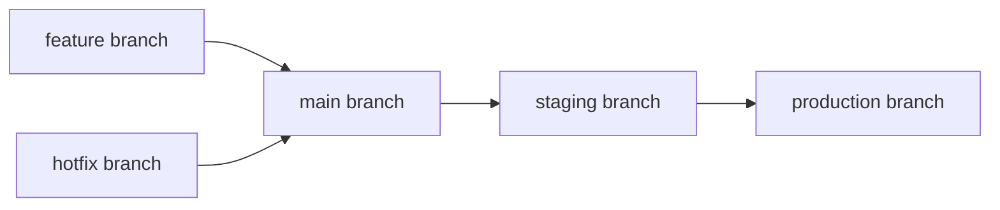
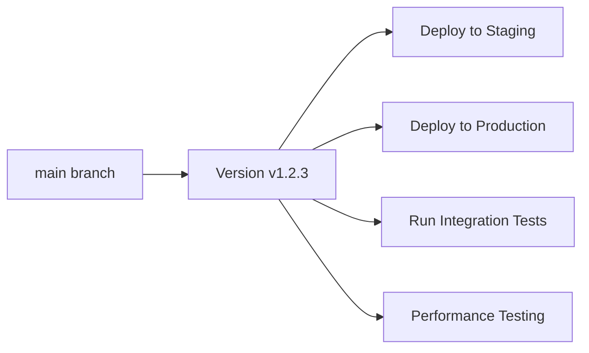

# AgileFlow

In today’s fast-paced software development landscape, maintaining clarity, consistency, and efficiency in the release process is essential. AgileFlow is a streamlined yet powerful versioning system, branching strategy, and CI/CD tool designed for software teams of all sizes and projects of any scale.

AgileFlow enforces Semantic Versioning and integrates a robust branching strategy for development and deployment. It seamlessly works with GitLab CI pipelines to ensure a structured, efficient, and predictable development lifecycle. **All versions are calculated from the main branch's commit history**, ensuring consistent versioning and release notes. Whether for small projects or large-scale deployments, AgileFlow is an indispensable tool that simplifies versioning and release management.


AgileFlow works integrated with the CI/CD engine to **automatically create a new version** every time there's a merge into the main branch, incrementing the patch number based on the latest identifiable version in the repository.

# Installation

## GitLab CI

AgileFlow integrates with GitLab CI to automate version tagging. Add the following line at the top of `.gitlab-ci.yml`:

```yml
include:
  - remote: code.logickernel.com/kernel/agileflow/-/raw/main/templates/AgileFlow.gitlab-ci.yml
```

> [!NOTE]
> To allow the pipeline to push tags enable `Allow Git push requests to the repository` for the CI job token under `Settings > CI/CD > Job token permissions`.
>
> You may need to enable the feature flag `allow_push_repository_for_job_token` in your self-managed instance to see it.


# Principles

Once AgileFlow is installed in [GitLab](#gitlab-ci):

1. **Main Branch**: Use the main branch (or master) as your primary release branch
2. [Create development branches](#development-branches) for contributors to keep the code organized
3. Merge development branches into main when ready, and AgileFlow automatically creates the next version tag based on the main branch's history

## Main Branch Strategy

The main branch is the core of the AgileFlow framework. It serves as the single source of truth for all releases and versioning.

**Key Benefits:**
- **Single Version Sequence**: All versions (v1.0.0, v1.0.1, v1.1.0, etc.) are created from the same branch
- **Simplified Workflow**: No need to manage multiple release branches
- **Consistent History**: All releases share the same commit history and lineage
- **Easy Rollbacks**: Simple to revert to any previous version since all versions are on the same branch

**Version Management:**
- Patch versions (v1.0.0 → v1.0.1) are automatically incremented on each merge to main
- Minor versions (v1.0.0 → v1.1.0) are created by merging significant features
- Major versions (v1.0.0 → v2.0.0) are created for breaking changes

## Development Branches

Development branches are used for feature additions and bug fixes. They branch off the main branch and merge back into it when ready. Consider using expressive names depending on their purpose, e.g.: `dev/*`, `feat/*`, `fix/*`, and `hotfix/*`.

After the contribution is ready, the development branch is merged into main, preferably using a [Merge Request](https://docs.gitlab.com/ee/user/project/merge_requests/) or similar.


### Conventional Commits

Conventional Commits encode the intent of a change in the commit subject so that humans (and tools) can generate clear release notes and version bumps.

Commit subject format:

```text
type[!]?(scope)?: description
```

- **type**: one of the recognized types below (lowercase).
- **scope (optional)**: short, lowercase noun describing the affected area, e.g. `api`, `auth`, `build`.
- **description**: concise, imperative mood summary (e.g., "add support for...", "fix crash when...").
- Use the commit body for rationale/details, and use footers for metadata (e.g., `BREAKING CHANGE:`).

Recognized commit types (release notes order):

- **feat — Features**: Introduces new user- or API-facing capabilities without removing existing behavior.
  - **Use for**: new endpoints, CLI commands, configuration options, UI components, additive DB migrations.
  - **Avoid for**: internal-only refactors or performance tweaks that do not add capability.
  - **Example**: `feat(api): expose /v2/reports endpoint`

- **fix — Bug fixes**: Corrects faulty behavior, regressions, crashes, data corruption, or incorrect outputs.
  - **Use for**: logic errors, off-by-one fixes, null handling, race conditions, flaky behavior.
  - **Avoid for**: refactors that do not change externally observable behavior.
  - **Example**: `fix(auth): handle empty refresh token gracefully`

- **perf — Performance improvements**: Makes the system faster or leaner without changing public behavior or semantics.
  - **Use for**: algorithmic improvements, caching, reduced allocations, optimized queries, I/O batching.
  - **Avoid for**: feature additions or bug fixes; use those dedicated types instead.
  - **Example**: `perf(cache): batch writes to cut latency by 30%`

- **refactor — Refactors**: Internal code changes that do not alter external behavior; improves structure, readability, or maintainability.
  - **Use for**: renaming, extracting functions, reorganizing modules, paying down technical debt.
  - **Avoid for**: behavior changes (use `feat`, `fix`, or `perf`).
  - **Example**: `refactor(repo): split monolithic service into modules`

- **docs — Documentation**: Documentation-only changes.
  - **Use for**: README updates, API docs, examples, ADRs, inline docstrings.
  - **Avoid for**: code changes that affect behavior; pair with another type if both occur.
  - **Example**: `docs: add configuration examples for SSO`

- **build — Build system**: Changes that affect the build tooling or dependencies.
  - **Use for**: dependency bumps, lockfiles, Dockerfiles, Makefiles, build scripts, compilers, bundlers.
  - **Avoid for**: runtime code or CI-only config (use `ci` for that).
  - **Example**: `build(docker): slim image and enable build cache`

- **ci — CI**: Changes to continuous integration configuration and automation.
  - **Use for**: pipeline definitions, jobs, cache settings, CI scripts, badges.
  - **Avoid for**: build tooling that also affects local builds (use `build`).
  - **Example**: `ci(gitlab): add release job for tags`

- **chore — Chores**: Routine tasks that do not affect src behavior or tests.
  - **Use for**: repository housekeeping, license files, issue templates, renaming files without behavior change.
  - **Avoid for**: dependency/build changes (`build`), formatting-only changes (`style`).
  - **Example**: `chore: archive old roadmap documents`

- **test — Tests**: Adds or updates tests without changing runtime behavior.
  - **Use for**: new unit/integration/e2e tests, fixtures, test refactors.
  - **Avoid for**: fixing behavior (use `fix`) or adding features (`feat`).
  - **Example**: `test(api): cover error path for 404 responses`

- **style — Code style**: Non-functional changes that do not affect meaning of code.
  - **Use for**: formatting, whitespace, linters, code style fixes, reorder imports.
  - **Avoid for**: refactors or behavior changes.
  - **Example**: `style: apply Prettier 3 formatting`

- **revert — Reverts**: Reverts a previous commit.
  - **Use for**: explicit rollbacks; the body should reference the reverted commit.
  - **Example**: `revert: feat(api): expose /v2/reports endpoint`

- **Other changes**: Commits that don't match the conventional format or are unclassified. These are listed verbatim when at least one conventional commit is present.

Breaking changes are flagged using the `!` shorthand in the subject (for example, `feat!:`) or with a `BREAKING CHANGE:` footer. After `1.0.0`, breaking changes should drive a **MAJOR** version bump per SemVer.

Examples of conventional commit subjects:

```text
feat(auth): add OIDC login flow
fix(api): correct null handling in user lookup
perf(cache)!: switch to Redis cluster
docs: update README with usage examples
```

### Tag Messages

AgileFlow elevates release notes by grouping the annotated tag message according to the intent of each change, following the [Conventional Commits](https://www.conventionalcommits.org/) methodology.


Example of the generated tag message body when conventional commits are detected:

```text
v1.2.4

Features:
- auth: add OIDC login flow

Bug fixes:
- api: correct null handling in user lookup

Performance improvements:
- BREAKING: cache: switch to Redis cluster

Documentation:
- update README with usage examples
```

When commits are not in the conventional format, AgileFlow will produce a simple list:

```text
v1.2.4
- Merge branch 'feat/ui-polish'
- Tweak logging verbosity
- Fix typo in pipeline
```

# Version-Centric CI/CD Approach

AgileFlow introduces a revolutionary approach to CI/CD that prioritizes **version management over environment-based deployments**. This paradigm shift eliminates the complexity of managing multiple deployment branches and environments, replacing them with a streamlined, version-focused workflow.

## Traditional Git-Based Flows vs. AgileFlow

### Traditional Approach (Branch-Based Environments)
Traditional CI/CD pipelines often rely on branch-based environment management:



**Problems with Traditional Approach:**
- **Environment Drift**: Different branches can diverge, leading to "works in staging, breaks in production"
- **Complex Branch Management**: Multiple long-lived branches require constant synchronization
- **Deployment Uncertainty**: Hard to know exactly what version is running in each environment
- **Rollback Complexity**: Rolling back requires managing multiple branch states
- **Version Inconsistency**: Different environments may run different versions

### AgileFlow Approach (Version-Centric)
AgileFlow simplifies this by making **every deployment, test, and operation version-centric**:



**Benefits of Version-Centric Approach:**
- **Single Source of Truth**: All environments run the exact same version
- **Predictable Deployments**: Every deployment uses a well-identified, immutable version
- **Simplified Rollbacks**: Rollback to any previous version with confidence
- **Consistent Testing**: All tests run against the same version that will be deployed
- **Clear Audit Trail**: Every deployment is tied to a specific, documented version

## Simplified Pipeline Stages

AgileFlow's CI/CD pipeline consists of just 5 focused stages:

### 1. **Version** Stage
- **Purpose**: Generate semantic version and comprehensive release notes
- **Output**: `VERSION` variable available to all subsequent stages
- **Automation**: Uses AgileFlow tool to analyze commit history and determine next version
- **Artifacts**: Version tag pushed to repository, release notes generated

### 2. **Build** Stage
- **Purpose**: Create application artifacts and Docker images
- **Input**: Uses the `VERSION` variable from the version stage
- **Output**: Versioned artifacts (e.g., `app:v1.2.3`, `frontend:v1.2.3`)
- **Consistency**: All builds use the same version identifier

### 3. **Deploy** Stage
- **Purpose**: Deploy the versioned artifacts to various environments
- **Approach**: Deploy the same version to staging, production, etc.
- **Benefits**: Identical behavior across all environments
- **Rollback**: Simple version-based rollback (e.g., "rollback to v1.2.2")

### 4. **Test** Stage
- **Purpose**: Validate the deployed version
- **Scope**: Integration tests, end-to-end tests, performance tests
- **Target**: Tests run against the actual deployed version
- **Confidence**: Tests validate exactly what will run in production

### 5. **Clean** Stage
- **Purpose**: Cleanup temporary resources and artifacts
- **Maintenance**: Remove old Docker images, temporary files, etc.
- **Optimization**: Keep only necessary version artifacts

## Real-World Example

Here's how the version-centric approach works in practice:

```yaml
# .gitlab-ci.yml
include:
  - local: templates/AgileFlow.gitlab-ci.yml

# Build stage uses VERSION from agileflow job
build:
  stage: build
  script:
    - docker build -t myapp:${VERSION} .
    - docker push myapp:${VERSION}

# Deploy stage deploys the same version everywhere
deploy-staging:
  stage: deploy
  script:
    - kubectl set image deployment/myapp myapp=myapp:${VERSION}
  environment:
    name: staging

deploy-production:
  stage: deploy
  script:
    - kubectl set image deployment/myapp myapp=myapp:${VERSION}
  environment:
    name: production
  when: manual

# Test stage validates the deployed version
integration-tests:
  stage: test
  script:
    - ./run-tests.sh --version ${VERSION}
```

## Key Advantages

1. **Eliminates Environment Drift**: Staging and production always run identical versions
2. **Simplifies Operations**: DevOps teams work with versions, not branch states
3. **Improves Reliability**: Every deployment is predictable and auditable
4. **Reduces Complexity**: No need to manage multiple deployment branches
5. **Enhances Security**: Version-based deployments provide clear audit trails
6. **Facilitates Compliance**: Easy to demonstrate what version is running where

## Migration Path

If you're currently using a traditional branch-based approach:

1. **Start with AgileFlow**: Include the template and let it generate versions
2. **Gradually Simplify**: Remove environment-specific branches over time
3. **Update Deployments**: Modify deployment scripts to use `${VERSION}` variable
4. **Standardize Testing**: Run all tests against the versioned artifacts
5. **Document Changes**: Update runbooks to reference versions instead of branches

This approach transforms your CI/CD from a complex, branch-managed system into a simple, version-driven pipeline where every deployment is predictable, auditable, and reliable.
