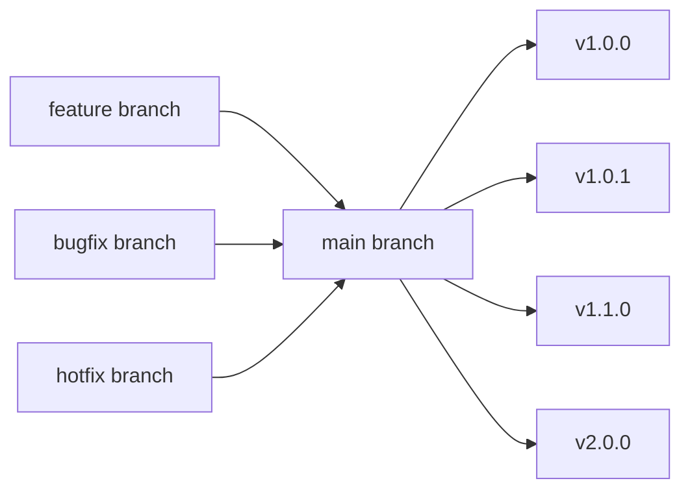
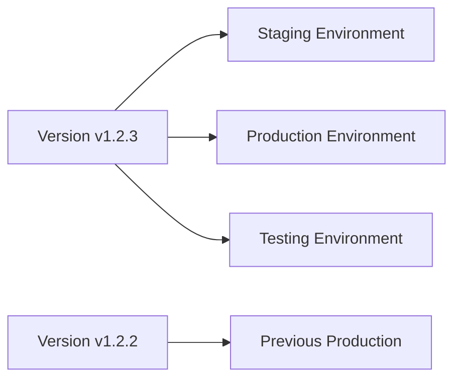

# Branching Strategy Guide

AgileFlow introduces a simplified, yet powerful branching strategy that eliminates the complexity of traditional multi-branch workflows while maintaining flexibility for development teams.

## Overview

Unlike traditional Git workflows that rely on multiple long-lived branches for different environments, AgileFlow uses a **main-branch-first approach** where:

- **Main branch** is the single source of truth for all releases
- **Development branches** are short-lived and focused on specific changes
- **All versions** are created from the same branch, ensuring consistency
- **Environment management** is handled through configuration, not branches

## Core Principles

### 1. Main Branch as Release Source

The main branch (or master) serves as the foundation for all releases:



**Key Benefits:**
- **Single Version Sequence**: All versions share the same lineage
- **Consistent History**: Every release builds on the same foundation
- **Simplified Rollbacks**: Easy to revert to any previous version
- **No Branch Drift**: All environments can run identical versions

### 2. Short-Lived Development Branches

Development branches are created for specific purposes and merged back quickly:

- **Purpose**: Implement features, fix bugs, or make improvements
- **Lifespan**: Days to weeks, not months
- **Target**: Always merge back to main when complete
- **Naming**: Descriptive names that indicate purpose

### 3. Version-Centric Deployments

Instead of branch-based environments, AgileFlow uses version-based deployments:



## Branch Types and Naming

### Feature Branches

For new features and enhancements:

```bash
# Branch naming patterns
git checkout -b feat/user-authentication
git checkout -b feat/api-rate-limiting
git checkout -b feat/dark-mode-ui
```

**When to use:**
- Adding new functionality
- Implementing user stories
- Creating new API endpoints
- Adding new UI components

**Workflow:**
1. Create branch from main
2. Implement feature with conventional commits
3. Test thoroughly
4. Create merge request
5. Merge to main (triggers version bump)

### Bug Fix Branches

For fixing bugs and issues:

```bash
# Branch naming patterns
git checkout -b fix/login-validation-error
git checkout -b fix/api-timeout-issue
git checkout -b fix/memory-leak
```

**When to use:**
- Fixing production bugs
- Resolving test failures
- Addressing security issues
- Fixing performance problems

**Workflow:**
1. Create branch from main
2. Fix the issue with conventional commits
3. Add tests to prevent regression
4. Create merge request
5. Merge to main (triggers patch version)

### Hotfix Branches

For urgent production fixes:

```bash
# Branch naming patterns
git checkout -b hotfix/critical-security-patch
git checkout -b hotfix/database-connection-fix
git checkout -b hotfix/urgent-performance-fix
```

**When to use:**
- Critical production issues
- Security vulnerabilities
- Data corruption issues
- Service outages

**Workflow:**
1. Create branch from main
2. Implement minimal fix
3. Test thoroughly
4. Create merge request
5. Merge to main (triggers immediate patch version)
6. Deploy immediately

### Refactor Branches

For code improvements and technical debt:

```bash
# Branch naming patterns
git checkout -b refactor/auth-service
git checkout -b refactor/database-layer
git checkout -b refactor/api-structure
```

**When to use:**
- Improving code structure
- Reducing technical debt
- Optimizing performance
- Modernizing dependencies

**Workflow:**
1. Create branch from main
2. Implement refactoring
3. Ensure all tests pass
4. Create merge request
5. Merge to main (triggers patch version)

## Branch Lifecycle

### 1. Creation

```bash
# Always start from main
git checkout main
git pull origin main

# Create new branch
git checkout -b feat/new-feature
```

**Best Practices:**
- Always start from an up-to-date main branch
- Use descriptive branch names
- Include type prefix (feat/, fix/, refactor/, etc.)

### 2. Development

```bash
# Make changes with conventional commits
git add .
git commit -m "feat: implement user authentication system"
git commit -m "test: add authentication unit tests"
git commit -m "docs: update API documentation"
```

**Best Practices:**
- Use conventional commits consistently
- Make small, focused commits
- Include tests for new functionality
- Update documentation as needed

### 3. Integration

```bash
# Keep branch up to date with main
git checkout main
git pull origin main
git checkout feat/new-feature
git rebase main
```

**Best Practices:**
- Rebase regularly to avoid conflicts
- Resolve conflicts during rebase
- Keep commits clean and logical

### 4. Completion

```bash
# Push branch and create merge request
git push origin feat/new-feature
```

**Best Practices:**
- Ensure all tests pass
- Code review completed
- Documentation updated
- Ready for production

### 5. Merge and Cleanup

```bash
# After merge request is approved and merged
git checkout main
git pull origin main
git branch -d feat/new-feature
git push origin --delete feat/new-feature
```

**Best Practices:**
- Delete local branch after merge
- Delete remote branch after merge
- Keep repository clean

## Version Management

### Automatic Version Bumping

AgileFlow automatically determines version bumps based on commit types:

```bash
# Patch version (v1.0.0 → v1.0.1)
fix: resolve login bug
docs: update README
refactor: improve error handling

# Minor version (v1.0.0 → v1.1.0)
feat: add user authentication
perf: optimize database queries

# Major version (v1.0.0 → v2.0.0)
feat!: remove deprecated API
BREAKING CHANGE: change database schema
```

### Version Tags

Every merge to main creates a new version tag:

```bash
# View all versions
git tag --sort=-version:refname

# Checkout specific version
git checkout v1.2.3

# View version details
git show v1.2.3
```

## Environment Management

### Configuration Over Code

Instead of different branches for different environments, use configuration:

```yaml
# .gitlab-ci.yml
deploy-staging:
  stage: deploy
  script:
    - kubectl set image deployment/myapp myapp=myapp:${VERSION}
  environment:
    name: staging
  variables:
    DATABASE_URL: "staging-db.example.com"
    LOG_LEVEL: "debug"

deploy-production:
  stage: deploy
  script:
    - kubectl set image deployment/myapp myapp=myapp:${VERSION}
  environment:
    name: production
  variables:
    DATABASE_URL: "prod-db.example.com"
    LOG_LEVEL: "info"
```

### Environment-Specific Configs

```yaml
# config/staging.yaml
database:
  host: staging-db.example.com
  port: 5432
  ssl: false

# config/production.yaml
database:
  host: prod-db.example.com
  port: 5432
  ssl: true
```

## Best Practices

### 1. Keep Branches Small and Focused

```bash
# ✅ Good - Single purpose
git checkout -b feat/user-login
git checkout -b fix/password-validation

# ❌ Bad - Multiple unrelated changes
git checkout -b feature-and-bugfixes
```

### 2. Use Conventional Commits

```bash
# ✅ Good
feat(auth): add OAuth2 login support
fix(api): handle null user ID gracefully
refactor(db): normalize user table schema

# ❌ Bad
add oauth login
fix bug
refactor stuff
```

### 3. Regular Integration

```bash
# Rebase weekly to avoid large conflicts
git checkout main
git pull origin main
git checkout your-branch
git rebase main
```

### 4. Clean Merge History

```bash
# Use rebase and merge for clean history
git checkout main
git pull origin main
git checkout feature-branch
git rebase main
git checkout main
git merge --ff-only feature-branch
```

### 5. Immediate Cleanup

```bash
# Delete branches after merge
git branch -d feature-branch
git push origin --delete feature-branch
```

## Migration from Traditional Workflows

### From GitFlow

If you're currently using GitFlow:

1. **Stop creating release branches** - use main for all releases
2. **Eliminate develop branch** - work directly from main
3. **Convert hotfix branches** to hotfix/ branches that merge to main
4. **Use feature branches** as before, but merge to main
5. **Implement AgileFlow** for version management

### From GitHub Flow

If you're using GitHub Flow:

1. **Keep main branch** as your primary branch
2. **Continue using feature branches** for development
3. **Add AgileFlow** for automatic versioning
4. **Use version-based deployments** instead of branch-based

### From Trunk-Based Development

If you're using trunk-based development:

1. **Continue working on main** for small changes
2. **Use feature branches** for larger changes
3. **Add AgileFlow** for version management
4. **Implement conventional commits** for automatic versioning

## Troubleshooting

### Common Issues

**Merge Conflicts**
- Rebase regularly to minimize conflicts
- Resolve conflicts during rebase, not merge
- Keep branches small and focused

**Branch Divergence**
- Always start from up-to-date main
- Rebase instead of merge when updating
- Delete branches after merge

**Version Conflicts**
- Ensure conventional commits are used
- Check that AgileFlow is properly configured
- Verify merge request process

### Getting Help

- **Documentation**: Check other guides in this documentation
- **Examples**: Review the getting started guide
- **Community**: Join discussions in the community forum
- **Issues**: Open an issue in the project repository

## Conclusion

AgileFlow's branching strategy provides a simplified, yet powerful approach to Git workflow management. By focusing on the main branch as the single source of truth and using short-lived development branches, teams can:

- **Reduce complexity** in their Git workflow
- **Maintain consistency** across all environments
- **Automate versioning** through conventional commits
- **Simplify deployments** with version-based releases
- **Improve collaboration** with clear branch purposes

This approach transforms complex multi-branch workflows into a streamlined, version-centric process that scales from small teams to large enterprises.
