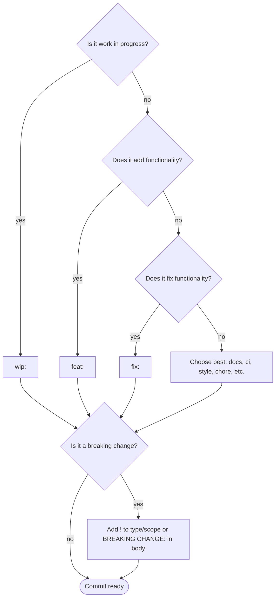

# Conventional Commits

AgileFlow uses [Conventional Commits](https://www.conventionalcommits.org/) to automatically determine version bumps and generate release notes.

## Commit Format

```
type(scope): description

[optional body]

[optional footer]
```

### Components

| Part | Required | Description |
|------|----------|-------------|
| `type` | Yes | Type of change (feat, fix, etc.) |
| `scope` | No | Area affected (auth, api, ui) |
| `!` | No | Breaking change indicator |
| `description` | Yes | Short summary |
| `body` | No | Detailed explanation |
| `footer` | No | Breaking changes, issue refs |

---

## How to Choose a Commit Type

Use this decision flow to choose the right commit type:



### Quick Decision Guide

1. **Work in progress?** → `wip:` (not included in releases)
2. **Adds new functionality?** → `feat:`
3. **Fixes broken functionality?** → `fix:`
4. **Otherwise?** → Choose the most appropriate:
   - `docs:` — Documentation changes
   - `ci:` — CI/CD changes
   - `style:` — Code style (formatting, whitespace)
   - `chore:` — Maintenance tasks
   - `test:` — Test changes
   - `refactor:` — Code refactoring
   - `perf:` — Performance improvements
   - `build:` — Build system changes
   - `revert:` — Revert previous commits
5. **Breaking change?** → Add `!` after type/scope or include `BREAKING CHANGE:` in body

### Examples

```bash
# Work in progress
wip: implement user authentication

# Adds functionality
feat: add user authentication
feat(auth): add OAuth2 support

# Fixes functionality
fix: resolve login validation error
fix(api): handle timeout errors

# Other types
docs: update API reference
ci: update GitHub Actions workflow
style: format code with prettier
chore: update dependencies

# Breaking changes
feat!: remove deprecated API endpoints
feat: change response format

BREAKING CHANGE: Response now uses camelCase
```

---

## Commit Types and Version Impact

| Type | Description | 1.0.0+ | 0.x.x |
|------|-------------|--------|-------|
| `feat` | New features | Minor | Minor |
| `fix` | Bug fixes | Patch | Patch |
| `perf` | Performance improvements | None | None |
| `refactor` | Code refactoring | None | None |
| `build` | Build system changes | None | None |
| `ci` | CI/CD changes | None | None |
| `test` | Test changes | None | None |
| `revert` | Revert commits | None | None |
| `docs` | Documentation | None | None |
| `style` | Code style | None | None |
| `chore` | Maintenance | None | None |

### Breaking Changes

Breaking changes trigger a major version bump (or minor for 0.x.x):

```bash
# Using ! suffix
feat!: remove deprecated API

# Using footer
feat: change response format

BREAKING CHANGE: Response now uses camelCase
```

---

## Version Bump Priority

When multiple commits exist, the highest priority wins:

1. **Breaking changes** → Major (or Minor for 0.x.x)
2. **Features** → Minor
3. **Fixes** → Patch
4. **Everything else** → No bump

### Example

If commits since last version include:
```
feat: add new dashboard
fix: resolve login bug
docs: update README
```

Result: **Minor bump** (feat has highest priority)

---

## Release Notes Generation

AgileFlow groups commits by type for release notes:

```
v1.2.4

### Features
- add user dashboard
- implement API rate limiting

### Bug fixes
- resolve login validation error
- fix timeout on large uploads

### Performance improvements
- optimize database queries

### Documentation
- update API reference
```

### Breaking Changes in Notes

Breaking changes are highlighted:

```
v2.0.0

### Features
- BREAKING: remove deprecated API endpoints
- BREAKING: change authentication flow
```

---

## Skip Release

Use `[skip release]` to prevent version bump:

```bash
chore(deps): bump jest to 29.0.0 [skip release]
docs: internal notes [skip release]
```

---

## Non-Conventional Commits

Commits not following the format:
- Trigger **no bump** by default
- Appear under "Other changes" in release notes
- Use `[skip release]` to prevent bump

---

## Best Practices

### 1. Use Clear Types

```bash
# ✅ Correct type
feat: add login feature
fix: resolve crash on startup

# ❌ Wrong type
fix: add login feature  # Should be feat
feat: fix crash         # Should be fix
```

### 2. Add Meaningful Scopes

```bash
# ✅ Helpful scope
feat(auth): add OAuth2 support
fix(api): handle timeout errors

# ✅ Also fine without scope
feat: add OAuth2 support
fix: handle timeout errors
```

### 3. Write Clear Descriptions

```bash
# ✅ Clear and specific
feat(auth): add two-factor authentication via SMS
fix(api): prevent timeout on uploads larger than 100MB

# ❌ Vague
feat: add 2fa
fix: fix timeout
```

### 4. Mark Breaking Changes

```bash
# ✅ Properly marked
feat!: remove deprecated endpoints

# ❌ Breaking change not marked
feat: remove deprecated endpoints
```

### 5. Use Present Tense

```bash
# ✅ Present tense
feat: add user authentication

# ❌ Past tense
feat: added user authentication
```

---

## Related Documentation

- [Getting Started](./getting-started.md) — Quick start
- [Release Management](./release-management.md) — Version management
- [Branching Strategy](./branching-strategy.md) — Git workflow
