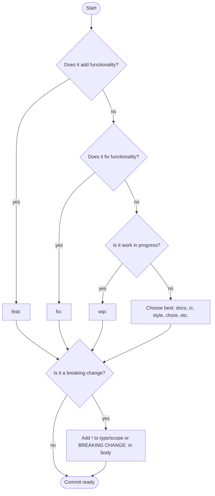

# Conventional Commits

AgileFlow uses [Conventional Commits](https://www.conventionalcommits.org/) to automatically determine version bumps and generate release notes.

## What are Conventional Commits?

The Conventional Commits specification is a lightweight convention on top of commit messages. It provides an easy set of rules for creating an explicit commit history, which makes it easier to write automated tools on top of. This convention dovetails with [SemVer](https://semver.org/), by describing the features, fixes, and breaking changes made in commit messages.

The commit message should be structured as follows:

```
<type>[optional scope]: <description>

[optional body]

[optional footer(s)]
```

The commit contains the following structural elements, to communicate intent to the consumers of your library:

- **`fix:`** — A commit of the type `fix` patches a bug in your codebase (this correlates with **PATCH** in Semantic Versioning).
- **`feat:`** — A commit of the type `feat` introduces a new feature to the codebase (this correlates with **MINOR** in Semantic Versioning).
- **`BREAKING CHANGE:`** — A commit that has a footer `BREAKING CHANGE:`, or appends a `!` after the type/scope, introduces a breaking API change (correlating with **MAJOR** in Semantic Versioning). A `BREAKING CHANGE` can be part of commits of any type.
- **Other types** — Types other than `fix:` and `feat:` are allowed (e.g., `build:`, `chore:`, `ci:`, `docs:`, `style:`, `refactor:`, `perf:`, `test:`, and others). These have no implicit effect in Semantic Versioning (unless they include a `BREAKING CHANGE`).
- **Scope** — A scope may be provided to a commit's type, to provide additional contextual information and is contained within parenthesis, e.g., `feat(parser): add ability to parse arrays`.
- **Footers** — Footers other than `BREAKING CHANGE: <description>` may be provided and follow a convention similar to git trailer format.

---

## How to Choose a Commit Type

Use this decision flow to choose the right commit type:



### Quick Decision Guide

1. **Adds new functionality?** → `feat:`
2. **Fixes broken functionality?** → `fix:`
3. **Work in progress?** → `wip:` (not included in releases)
4. **Otherwise?** → Choose the most appropriate:
   - `docs:` — Documentation changes
   - `ci:` — CI/CD changes
   - `style:` — Code style (formatting, whitespace)
   - `chore:` — Maintenance tasks
   - `test:` — Test changes
   - `refactor:` — Code refactoring
   - `perf:` — Performance improvements
   - `build:` — Build system changes
   - `revert:` — Revert previous commits
5. **Breaking change?** → Add `!` after type/scope or include `BREAKING CHANGE:` in body

### Examples

```bash
# Adds functionality
feat: add user authentication
feat(auth): add OAuth2 support

# Fixes functionality
fix: resolve login validation error
fix(api): handle timeout errors

# Work in progress
wip: implement user authentication

# Other types
docs: update API reference
ci: update GitHub Actions workflow
style: format code with prettier
chore: update dependencies

# Breaking changes
feat!: remove deprecated API endpoints
feat: change response format

BREAKING CHANGE: Response now uses camelCase
```

---

## Commit Types and Version Impact

| Type | Description | 0.x.x | 1.0.0+ |
|------|-------------|--------|-------|
| BREAKING CHANGE | Changes that break backward compatibility <br> (e.g., removed APIs, changed function signatures, modified response formats) | Minor | Major |
| `feat` | New features | Minor | Minor |
| `fix` | Bug fixes | Patch | Patch |
|  | Any other type of commit | None | None |

When multiple commits exist, the highest priority wins.

### Breaking Changes

Breaking changes trigger a major version bump (or minor for 0.x.x):

```bash
# Using ! suffix
feat!: remove deprecated API

# Using footer
feat: change response format

BREAKING CHANGE: Response now uses camelCase
```

---

## Release Notes Generation

AgileFlow groups commits by type for release notes:

```
v1.2.4

### Features
- add user dashboard
- implement API rate limiting

### Bug fixes
- resolve login validation error
- fix timeout on large uploads

### Performance improvements
- optimize database queries

### Documentation
- update API reference
```

### Breaking Changes in Notes

Breaking changes are highlighted:

```
v2.0.0

### Features
- BREAKING: remove deprecated API endpoints
- BREAKING: change authentication flow
```


---

## Non-Conventional Commits

Commits not following the format:
- Trigger **no bump** by default
- Appear under "Other changes" in release notes

---

## Best Practices

1. Use Clear Types

```bash
# ✅ Correct type
feat: add login feature
fix: resolve crash on startup

# ❌ Wrong type
fix: add login feature  # Should be feat
feat: fix crash         # Should be fix
```


2. Write Clear Descriptions

```bash
# ✅ Clear and specific
feat: add two-factor authentication via SMS
fix: prevent timeout on uploads larger than 100MB

# ❌ Vague
feat: add 2fa
fix: fix timeout
```

3. Mark Breaking Changes

```bash
# ✅ Properly marked
feat!: remove deprecated endpoints

# ❌ Breaking change not marked
feat: remove deprecated endpoints
```

4. Use Present Tense

```bash
# ✅ Present tense
feat: add user authentication

# ❌ Past tense
feat: added user authentication
```

5. Add Meaningful Scopes when applicable

```bash
# ✅ Helpful scope
feat(auth): add OAuth2 support
fix(api): handle timeout errors

# ✅ Also fine without scope
feat: add OAuth2 support
fix: handle timeout errors
```

---

## Related Documentation

- [Getting Started](./getting-started.md) — Quick start
- [Release Management](./release-management.md) — Version management
- [Branching Strategy](./branching-strategy.md) — Git workflow
