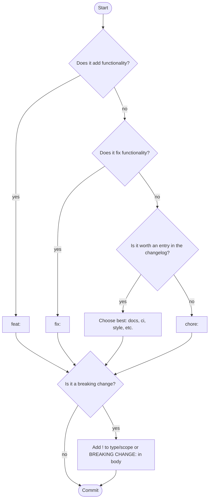

# Conventional Commits

AgileFlow uses [Conventional Commits](https://www.conventionalcommits.org/) to determine the next semantic version and generate changelogs.

## Format

```
<type>[optional scope]: <description>

[optional body]

[optional footer(s)]
```

Examples:
```
feat: add user authentication
fix(api): handle timeout errors
feat!: remove deprecated endpoints
docs: update README
```

---

## Version impact

| Commit | Example | Before v1.0.0 | v1.0.0 and after |
|--------|---------|---------------|------------------|
| Breaking change | `feat!: redesign API` | minor bump | major bump |
| `feat` | `feat: add login` | minor bump | minor bump |
| `fix` | `fix: resolve crash` | patch bump | patch bump |
| Everything else | `docs: update README` | no bump | no bump |

When multiple commits exist since the last tag, the highest-priority bump wins.

### Marking breaking changes

```bash
# Using ! after the type
feat!: remove deprecated API endpoints

# Using a BREAKING CHANGE footer
feat: change response format

BREAKING CHANGE: Response now uses camelCase instead of snake_case
```

---

## Commit types

| Type | Use for | Changelog |
|------|---------|-----------|
| `feat` | New functionality | Yes — Features |
| `fix` | Bug fixes | Yes — Bug fixes |
| `perf` | Performance improvements | Yes — Performance improvements |
| `refactor` | Code restructuring (no behavior change) | Yes — Other changes |
| `docs` | Documentation only | Yes — Documentation |
| `ci` | CI/CD configuration | Yes — Other changes |
| `test` | Tests only | No |
| `style` | Formatting, whitespace | No |
| `chore` | Maintenance tasks, work in progress | No |
| `build` | Build system changes | No |
| `revert` | Revert a previous commit | No |

Types not in this table appear under "Other changes" in the changelog.

---

## Choosing the right type



---

## Best practices

Use present tense: `feat: add login` not `feat: added login`

Be specific: `fix: prevent timeout on uploads larger than 100MB` not `fix: fix timeout`

Use `chore:` for work in progress so it doesn't add noise to the changelog:
```bash
# ✅ Won't appear in changelog
chore: scaffold form validation module

# ❌ Will appear as "Other changes" — misleading
refactor: scaffold form validation module
```

Use scopes to clarify context when helpful:
```bash
feat(auth): add OAuth2 support
fix(api): handle empty response body
```

---

## Changelog format

AgileFlow groups commits by type:

```
v1.5.0

### Features
- add dark mode
- add keyboard shortcuts

### Bug fixes
- resolve login timeout
- fix pagination on mobile

### Performance improvements
- optimize image loading
```

Breaking changes are highlighted:

```
v2.0.0

### Features
- BREAKING: remove deprecated v1 API endpoints
- add new v2 API
```

Non-conventional commits (no `type:` prefix) appear under "Other changes" and trigger no version bump.
