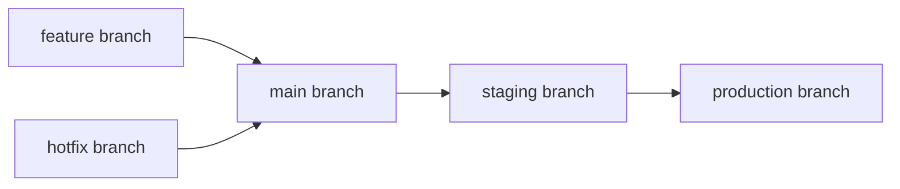
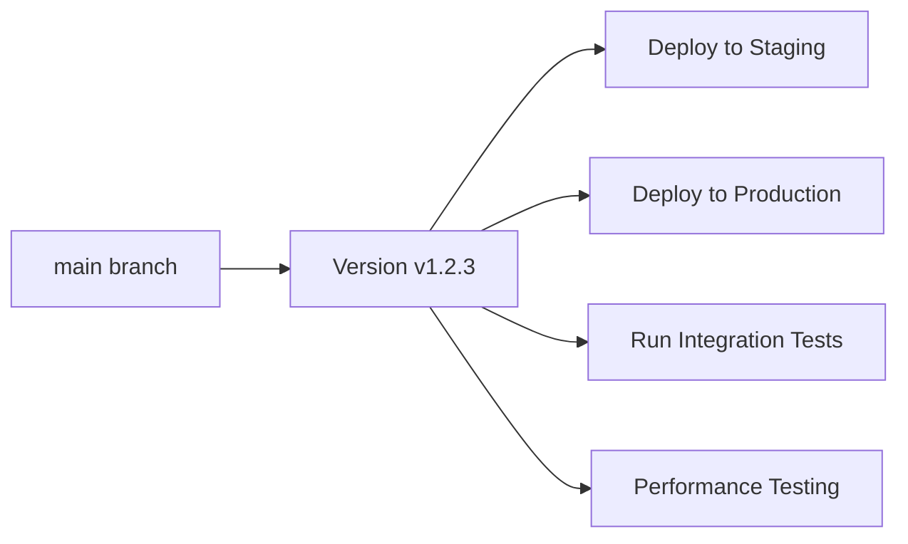

# Version-Centric CI/CD Approach

AgileFlow introduces a revolutionary approach to CI/CD that prioritizes **version management over environment-based deployments**. This paradigm shift eliminates the complexity of managing multiple deployment branches and environments, replacing them with a streamlined, version-focused workflow.

## Traditional Git-Based Flows vs. AgileFlow

### Traditional Approach (Branch-Based Environments)
Traditional CI/CD pipelines often rely on branch-based environment management:



**Problems with Traditional Approach:**
- **Environment Drift**: Different branches can diverge, leading to "works in staging, breaks in production"
- **Complex Branch Management**: Multiple long-lived branches require constant synchronization
- **Deployment Uncertainty**: Hard to know exactly what version is running in each environment
- **Rollback Complexity**: Rolling back requires managing multiple branch states
- **Version Inconsistency**: Different environments may run different versions

### AgileFlow Approach (Version-Centric)
AgileFlow simplifies this by making **every deployment, test, and operation version-centric**:



**Benefits of Version-Centric Approach:**
- **Single Source of Truth**: All environments run the exact same version
- **Predictable Deployments**: Every deployment uses a well-identified, immutable version
- **Simplified Rollbacks**: Rollback to any previous version with confidence
- **Consistent Testing**: All tests run against the same version that will be deployed
- **Clear Audit Trail**: Every deployment is tied to a specific, documented version

## Simplified Pipeline Stages

AgileFlow's CI/CD pipeline consists of just 5 focused stages:

### 1. **Version** Stage
- **Purpose**: Generate semantic version and comprehensive release notes
- **Output**: `VERSION` variable available to all subsequent stages
- **Automation**: Uses AgileFlow tool to analyze commit history and determine next version
- **Artifacts**: Version tag pushed to repository, release notes generated

### 2. **Build** Stage
- **Purpose**: Create application artifacts and Docker images
- **Input**: Uses the `VERSION` variable from the version stage
- **Output**: Versioned artifacts (e.g., `app:v1.2.3`, `frontend:v1.2.3`)
- **Consistency**: All builds use the same version identifier

### 3. **Deploy** Stage
- **Purpose**: Deploy the versioned artifacts to various environments
- **Approach**: Deploy the same version to staging, production, etc.
- **Benefits**: Identical behavior across all environments
- **Rollback**: Simple version-based rollback (e.g., "rollback to v1.2.2")

### 4. **Test** Stage
- **Purpose**: Validate the deployed version
- **Scope**: Integration tests, end-to-end tests, performance tests
- **Target**: Tests run against the actual deployed version
- **Confidence**: Tests validate exactly what will run in production

### 5. **Clean** Stage
- **Purpose**: Cleanup temporary resources and artifacts
- **Maintenance**: Remove old Docker images, temporary files, etc.
- **Optimization**: Keep only necessary version artifacts

## Real-World Example

Here's how the version-centric approach works in practice:

```yaml
# .gitlab-ci.yml
include:
  - local: templates/AgileFlow.gitlab-ci.yml

# Build stage uses VERSION from agileflow job
build:
  stage: build
  script:
    - docker build -t myapp:${VERSION} .
    - docker push myapp:${VERSION}

# Deploy stage deploys the same version everywhere
deploy-testing:
  stage: deploy
  script:
    - kubectl set image deployment/myapp myapp=myapp:${VERSION}
  environment:
    name: testing

deploy-staging:
  stage: deploy
  script:
    - kubectl set image deployment/myapp myapp=myapp:${VERSION}
  environment:
    name: staging
  when: manual

deploy-production:
  stage: deploy
  script:
    - kubectl set image deployment/myapp myapp=myapp:${VERSION}
  environment:
    name: production
  when: manual

# Test stage validates the deployed version
integration-tests:
  stage: test
  script:
    - ./run-tests.sh --version ${VERSION}
```

## Key Advantages

1. **Eliminates Environment Drift**: Staging and production always run identical versions
2. **Simplifies Operations**: DevOps teams work with versions, not branch states
3. **Improves Reliability**: Every deployment is predictable and auditable
4. **Reduces Complexity**: No need to manage multiple deployment branches
5. **Enhances Security**: Version-based deployments provide clear audit trails
6. **Facilitates Compliance**: Easy to demonstrate what version is running where

## Migration Path

If you're currently using a traditional branch-based approach:

1. **Start with AgileFlow**: Include the template and let it generate versions
2. **Gradually Simplify**: Remove environment-specific branches over time
3. **Update Deployments**: Modify deployment scripts to use `${VERSION}` variable
4. **Standardize Testing**: Run all tests against the versioned artifacts
5. **Document Changes**: Update runbooks to reference versions instead of branches

This approach transforms your CI/CD from a complex, branch-managed system into a simple, version-driven pipeline where every deployment is predictable, auditable, and reliable.
